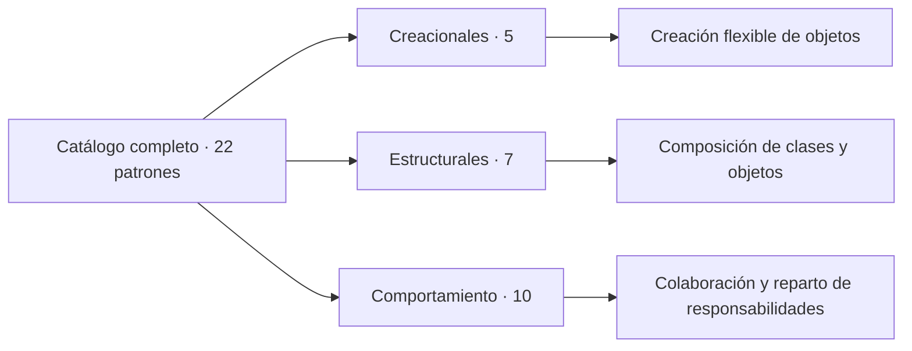

<div align="center">

# Design Patterns en Java

**Los 22 patrones del catálogo de Refactoring.Guru, explicados con ejemplos pequeños,
originales y ejecutables.**

[](https://github.com/albertoiNET/designpatterns/actions/workflows/ci.yml)
[](https://openjdk.org/)
[](#catálogo)
[](LICENSE)

Una colección didáctica para reconocer **cuándo**, **por qué** y **cómo** aplicar cada patrón
sin esconder su estructura detrás de frameworks.

</div>

---

## Qué encontrarás

- Un módulo Maven independiente por patrón.
- Un dominio diferente para cada ejemplo, sin replicar los ejemplos de
  [Refactoring.Guru](https://refactoring.guru/design-patterns).
- Participantes del patrón separados en clases e interfaces fáciles de localizar.
- Una clase `Main...` para recorrer el ejemplo y pruebas que demuestran su comportamiento.
- Java 21, JUnit Jupiter y cobertura con JaCoCo.

> **Alcance:** Refactoring.Guru reúne 22 patrones basados en el catálogo GoF. El patrón
> Interpreter, presente en el libro original pero no en esa referencia web, queda fuera
> de este inventario.



## Catálogo

### Patrones creacionales

| Patrón | Para qué sirve | Ejemplo del repositorio |
|---|---|---|
| [Abstract Factory](abstract-factory/) | Crea familias completas de objetos compatibles sin acoplar el cliente a clases concretas. | Equipamiento coordinado para recintos interiores y exteriores. |
| [Builder](builder/) | Construye objetos complejos paso a paso y permite variar su representación. | Configuración de distintos modelos de automóvil. |
| [Factory Method](factory-method/) | Delega en una subclase la elección del producto que se instancia. | Un creador que decide el producto concreto. |
| [Prototype](prototype/) | Obtiene nuevos objetos copiando una instancia existente. | Copias superficiales y profundas de clústeres de nodos. |
| [Singleton](singleton/) | Garantiza una única instancia y un punto de acceso compartido. | Instancia global con inicialización diferida. |

### Patrones estructurales

| Patrón | Para qué sirve | Ejemplo del repositorio |
|---|---|---|
| [Adapter](adapter/) | Traduce una interfaz existente a la que necesita el cliente. | Adaptación de un registro bibliotecario heredado. |
| [Bridge](bridge/) | Permite evolucionar una abstracción y su implementación por separado. | Boletines de montaña enviados por radio o panel. |
| [Composite](composite/) | Trata objetos individuales y grupos mediante la misma interfaz. | Planes jerárquicos de mantenimiento de parques. |
| [Decorator](decorator/) | Añade responsabilidades componibles sin multiplicar subclases. | Etiquetas de envío con seguimiento y cadena de frío. |
| [Facade](facade/) | Ofrece una entrada sencilla a un subsistema con varios pasos. | Publicación completa de un episodio de pódcast. |
| [Flyweight](flyweight/) | Comparte estado inmutable para representar muchos objetos con menos memoria. | Símbolos reutilizados en un mapa de transporte. |
| [Proxy](proxy/) | Controla el acceso a otro objeto manteniendo su misma interfaz. | Caché y autorización para un archivo de investigación. |

### Patrones de comportamiento

| Patrón | Para qué sirve | Ejemplo del repositorio |
|---|---|---|
| [Chain of Responsibility](chain-of-responsibility/) | Pasa una petición por una cadena hasta que un elemento puede resolverla. | Aprobación de solicitudes de un huerto comunitario. |
| [Command](command/) | Encapsula una acción para poder encolarla, registrarla o deshacerla. | Operaciones reversibles de un telescopio. |
| [Iterator](iterator/) | Recorre una colección sin exponer su representación interna. | Recorrido filtrado de un diario astronómico. |
| [Mediator](mediator/) | Centraliza la comunicación para reducir dependencias entre colegas. | Coordinación de una sesión en un estudio de grabación. |
| [Memento](memento/) | Guarda y restaura el estado sin romper la encapsulación. | Puntos de guardado de una campaña de juego de mesa. |
| [Observer](observer/) | Notifica automáticamente a varios interesados cuando cambia un sujeto. | Alertas de disponibilidad de estaciones de bicicletas. |
| [State](state/) | Cambia el comportamiento de un objeto cuando cambia su estado interno. | Ciclo de vida del alquiler de un patinete eléctrico. |
| [Strategy](strategy/) | Intercambia algoritmos detrás de un contrato común. | Reparto de energía en una comunidad solar. |
| [Template Method](template-method/) | Define un algoritmo base y deja ciertos pasos a las subclases. | Flujo de tueste para distintos cafés de especialidad. |
| [Visitor](visitor/) | Añade operaciones sobre una estructura sin modificar sus elementos. | Inspecciones de activos de una reserva natural. |

### Patrones adicionales

| Patrón | Para qué sirve | Ejemplo del repositorio |
|---|---|---|
| [Multiton](multiton/) | Mantiene una instancia compartida por cada clave conocida. | Registro de instancias por tipo. |
| [Object Pool](object-pool/) | Reutiliza objetos costosos y limita cuántos se crean. | Pool acotado de conexiones a una base de datos. |

## Puesta en marcha

Necesitas **JDK 21** y **Maven 3.9 o superior**.

```bash
git clone https://github.com/albertoiNET/designpatterns.git
cd designpatterns
mvn clean verify
```

Para trabajar únicamente con un patrón:

```bash
mvn -pl adapter -am test
mvn -pl adapter -am compile
java -cp adapter/target/classes net.albertoi.adapter.MainAdapter
```

Sustituye `adapter` y `MainAdapter` por el módulo que quieras explorar.

## Anatomía de cada ejemplo

```text
pattern-name/
├── pom.xml
└── src/
    ├── main/java/net/albertoi/.../
    │   ├── MainPattern.java       # Demostración ejecutable
    │   └── ...                    # Participantes del patrón
    └── test/java/net/albertoi/.../
        └── PatternTest.java       # Comportamiento esperado
```

Una forma práctica de estudiar cada módulo:

1. Lee primero la prueba para identificar el problema y el resultado esperado.
2. Localiza el contrato principal y sus implementaciones.
3. Ejecuta la clase `Main...` y cambia una implementación concreta.
4. Comprueba qué parte del cliente permanece estable gracias al patrón.

## Dependencias y mantenimiento

| Componente | Versión | Uso |
|---|---:|---|
| Java | 21 | Lenguaje y API base |
| JUnit Jupiter | 6.1.3 | Pruebas |
| Lombok | 1.18.46 | Reducción de código repetitivo en ejemplos existentes |
| HSQLDB | 2.7.4 | Base de datos en memoria del Object Pool |
| JaCoCo | 0.8.15 | Cobertura |
| Maven Compiler Plugin | 3.15.0 | Compilación reproducible para Java 21 |
| Maven Enforcer Plugin | 3.6.3 | Validación de las versiones mínimas del entorno |
| Maven Surefire Plugin | 3.5.6 | Ejecución de pruebas |

Las versiones están centralizadas en el `pom.xml` raíz. Dependabot revisa semanalmente tanto
las dependencias Maven como las acciones de CI para evitar que vuelvan a quedar obsoletas.

## Referencias

- *Design Patterns: Elements of Reusable Object-Oriented Software*, Erich Gamma,
  Richard Helm, Ralph Johnson y John Vlissides.
- [Catálogo de patrones de Refactoring.Guru](https://refactoring.guru/design-patterns),
  usado como referencia para delimitar y comprobar las 22 implementaciones.

## Licencia

Este proyecto se distribuye bajo los términos de la
[GNU General Public License v3.0](LICENSE).
